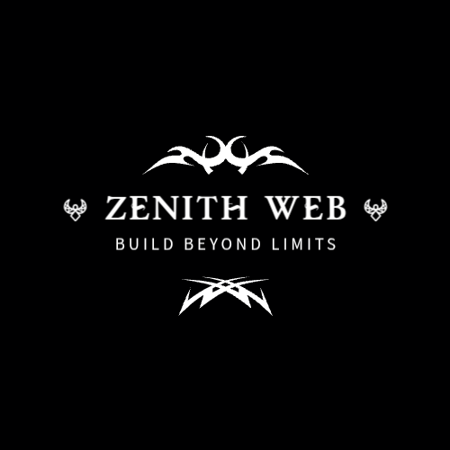

```markdown
# 🌟 Zenith Web

> Premium Digital Experiences That Elevate Brands



---

## 🚀 About

Zenith Web is a premium web design and development agency built for businesses that want more than just a website. We craft digital experiences that build trust, attract customers, and help brands grow.

This repository contains the complete source code for our agency landing page — a showcase of our design philosophy, technical capabilities, and commitment to craftsmanship.

**Live Site:** https://zenithweb.onrender.com/

---

## ✨ Features

- **🎨 Premium Design** — Modern, dark-themed UI with glass-morphism and smooth gradients
- **🖱️ Custom Cursor** — Interactive cursor with hover states and view mode
- **🎬 Smooth Animations** — GSAP-powered scroll animations and transitions
- **📜 Smooth Scrolling** — Lenis for buttery-smooth scroll experience
- **🌀 3D Interactions** — Tilt effects on cards and interactive build scene
- **📱 Fully Responsive** — Optimized for all devices from mobile to desktop
- **⚡ Performance Optimized** — Lazy loading, reduced motion support, and clean code
- **🔍 SEO Ready** — Meta tags, Open Graph, JSON-LD, sitemap, and robots.txt
- **💬 WhatsApp Integration** — Contact form sends directly to WhatsApp
- **♿ Accessible** — Keyboard navigation, focus states, and reduced motion preferences

---

## 🛠️ Tech Stack

| Technology | Purpose |
|------------|---------|
| HTML5 | Structure & semantics |
| CSS3 | Styling, animations, responsive design |
| JavaScript (ES6+) | Interactivity & logic |
| GSAP | Advanced animations & scroll triggers |
| ScrollTrigger | Scroll-based animations |
| Lenis | Smooth scrolling |
| Font Awesome | Icons |
| Google Fonts | Bricolage Grotesque & Inter |

---

## 📁 Project Structure

```

zenithweb/
├── index.html              # Main HTML file
├── sitemap.xml             # SEO sitemap
├── robots.txt              # Search engine instructions
├── web.manifest            # PWA manifest
├── assets/
│   ├── css/
│   │   └── style.css       # All styles
│   ├── js/
│   │   └── script.js       # All JavaScript
│   └── images/
│       ├── logo.png        # Brand logo
│       ├── favicon-32.png  # Favicon 32px
│       ├── favicon-16.png  # Favicon 16px
│       ├── apple-touch-icon.png  # iOS icon
│       ├── favicon.svg     # Vector favicon
│       ├── project-bigwura.png  # Case study image
│       └── og-image.png    # Social sharing image
└── README.md               # This file

```

---

## 🚀 Quick Start

### 1. Clone the Repository
```bash
git clone https://github.com/zenithweb111/zenithweb.git
cd zenithweb
```

2. Open Locally

Simply open index.html in your browser, or use Live Server:

```bash
# Using VS Code Live Server
Right-click index.html → Open with Live Server
```

3. Deploy to Vercel (Recommended)

```bash
# Install Vercel CLI
npm i -g vercel

# Deploy
vercel
```

Or drag-and-drop to https://vercel.com

---

🌐 Deployment

Platform Method
Vercel Drag & drop or vercel CLI
Netlify Drag & drop folder
GitHub Pages Push to gh-pages branch

---

🎯 Key Sections

· Hero — Bold headline with interactive build scene
· About — Story-driven brand introduction
· Services — Grid of offerings
· Pricing — Transparent packages with launch discounts
· Process — 5-step workflow
· Portfolio — Case study: Big Wura Hair Care
· Testimonials — Client feedback
· FAQ — Accordion-style questions
· Contact — WhatsApp-integrated form

---

🔧 Customization Guide

Colors

Edit CSS variables in assets/css/style.css:

```css
:root {
  --bg: #0B0B0F;
  --accent: #2563EB;
  --accent-light: #5B8DFF;
  --text: #FFFFFF;
  /* ... */
}
```

Content

· Text: Edit directly in index.html
· Images: Replace files in assets/images/
· Pricing: Update .pricing-card sections
· FAQ: Modify .faq-item elements

Contact Info

Update these in index.html:

WhatsApp number:
https://wa.me/2347084007921

Email:
zenithwebofficial111@gmail.com

Phone:
+234 708 400 7921

---

📱 Social Links

Instagram: https://instagram.com/zenithwebofficial111
TikTok: https://tiktok.com/@zenith_web

---

🤝 Contributing

This is a personal agency site, but if you spot improvements:

1. Fork the repo
2. Create a branch (git checkout -b feature/improvement)
3. Commit changes (git commit -m 'Add improvement')
4. Push to branch (git push origin feature/improvement)
5. Open a Pull Request

---

📄 License

This project is built by Zenith Web. All rights reserved.

---

🙏 Credits

· Design & Development: Zenith Web Team
· Animations: https://gsap.com/
· Smooth Scroll: https://lenis.studiofreight.com/
· Icons: https://fontawesome.com/
· Fonts: https://fonts.google.com/

---

📞 Contact

Email: zenithwebofficial111@gmail.com
Phone: +234 708 400 7921
WhatsApp: https://wa.me/2347084007921

---

⭐ Show Your Support

If you found this project helpful or inspiring:

· Star the repo
· Share on social media
· Tag us @zenithwebofficial111

---

Built with ❤️ from Nigeria, for the world.

Visit Zenith Web: https://zenithweb.onrender.com/

```